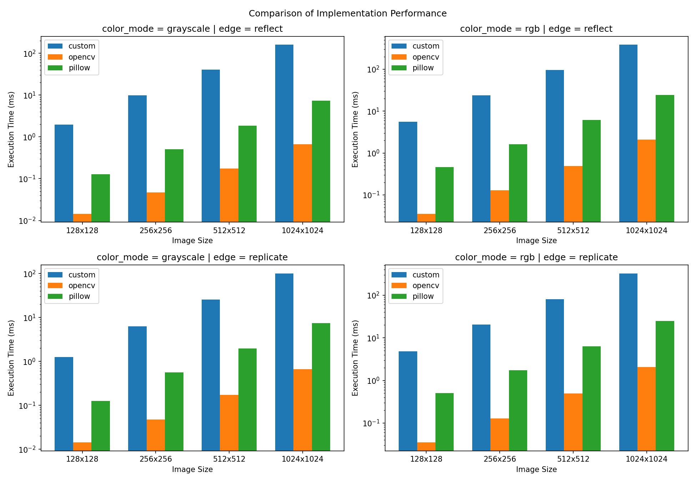

# Выводы по реализации и бенчмаркингу свёртки изображений

В данном разделе представлены результаты сравнения производительности собственной учебной реализации свёртки изображений, реализации OpenCV (`cv2.filter2D`) и фильтрации через Pillow.

Собственная реализация в проекте написана на Python с использованием NumPy. Это важно для интерпретации результатов: основная работа выполняется не чистыми вложенными Python-циклами, а векторизованными операциями NumPy.

## Методика тестирования

- Генерация тестовых изображений: изображения создаются случайно через NumPy, без чтения с диска. Это уменьшает влияние ввода-вывода на измерения.
- Размеры изображений: `128x128`, `256x256`, `512x512`, `1024x1024`, `1920x1080`, `2560x1440`, `3840x2160`.
- Ядра свёртки:
  - `box_blur`
  - `gaussian_blur`
  - `sobel_x`
  - `sharpen`
- Режимы обработки краёв:
  - `reflect`
  - `replicate`
- Типы изображений:
  - `grayscale`
  - `rgb`
- Инструмент измерения: `pytest-benchmark`.
- Единица измерения: среднее время одной операции свёртки в миллисекундах.
- Количество benchmark-кейсов: 336.

## Аппаратная и программная среда

Данные взяты из `tests/benchmark/results.json`.

| Параметр | Значение |
|---|---|
| CPU | Apple M1 |
| Архитектура | arm64 |
| ОС | Darwin 24.6.0 |
| Python | CPython 3.14.4 |
| Проект | `image-convultion-2sem` |

## Краткая сводка

По всем сопоставимым сценариям OpenCV быстрее собственной реализации примерно в диапазоне:

| Метрика | Значение |
|---|---:|
| Минимальное ускорение OpenCV | ~74.9x |
| Медианное ускорение OpenCV | ~181.8x |
| Среднее ускорение OpenCV | ~187.9x |
| Максимальное ускорение OpenCV | ~351.7x |

Pillow также быстрее собственной реализации, но обычно заметно медленнее OpenCV.

## Выборочные результаты

| Размер | Ядро | Режим | Тип | Собственная реализация, ms | OpenCV, ms | Pillow, ms | OpenCV быстрее |
|---|---|---|---|---:|---:|---:|---:|
| 256x256 | box_blur | replicate | rgb | 20.59 ± 0.46 | 0.154 ± 0.005 | 0.91 ± 0.08 | ~133.7x |
| 512x512 | box_blur | reflect | grayscale | 41.33 ± 0.58 | 0.210 ± 0.005 | 0.75 ± 0.03 | ~196.7x |
| 512x512 | gaussian_blur | reflect | grayscale | 40.70 ± 0.54 | 0.211 ± 0.007 | 0.75 ± 0.03 | ~192.4x |
| 512x512 | sobel_x | reflect | grayscale | 40.08 ± 0.45 | 0.149 ± 0.004 | 2.83 ± 0.05 | ~268.8x |
| 512x512 | sharpen | reflect | grayscale | 40.48 ± 0.56 | 0.130 ± 0.004 | 3.13 ± 0.05 | ~312.6x |
| 512x512 | box_blur | reflect | rgb | 96.64 ± 1.25 | 0.598 ± 0.011 | 2.75 ± 0.06 | ~161.7x |
| 512x512 | gaussian_blur | reflect | rgb | 97.15 ± 0.55 | 0.596 ± 0.008 | 2.74 ± 0.08 | ~163.1x |
| 512x512 | sobel_x | reflect | rgb | 95.80 ± 1.36 | 0.418 ± 0.008 | 9.10 ± 0.17 | ~229.0x |
| 512x512 | sharpen | reflect | rgb | 94.38 ± 0.98 | 0.360 ± 0.007 | 9.89 ± 0.11 | ~262.1x |
| 1024x1024 | box_blur | reflect | grayscale | 159.84 ± 2.71 | 0.803 ± 0.013 | 2.80 ± 0.08 | ~199.1x |
| 1024x1024 | box_blur | reflect | rgb | 383.73 ± 5.31 | 2.495 ± 0.045 | 10.73 ± 1.04 | ~153.8x |
| 3840x2160 | box_blur | reflect | grayscale | 1464.98 ± 33.53 | 6.611 ± 0.103 | 23.19 ± 0.29 | ~221.6x |
| 3840x2160 | box_blur | reflect | rgb | 3672.47 ± 40.50 | 20.247 ± 0.250 | 89.89 ± 0.71 | ~181.4x |

## Масштабирование по размеру изображения

Для ядра `box_blur` в режиме `reflect` время растёт примерно пропорционально количеству пикселей. Это видно по тому, что время на один мегапиксель остаётся относительно стабильным.

### Grayscale, box_blur, reflect

| Размер | Собственная реализация, ms/MP | OpenCV, ms/MP | Pillow, ms/MP |
|---|---:|---:|---:|
| 128x128 | 119.21 | 1.06 | 4.65 |
| 256x256 | 147.89 | 0.86 | 3.67 |
| 512x512 | 157.65 | 0.80 | 2.87 |
| 1024x1024 | 152.43 | 0.77 | 2.67 |
| 1920x1080 | 169.34 | 0.80 | 2.71 |
| 2560x1440 | 168.91 | 0.79 | 2.76 |
| 3840x2160 | 176.62 | 0.80 | 2.80 |

### RGB, box_blur, reflect

| Размер | Собственная реализация, ms/MP | OpenCV, ms/MP | Pillow, ms/MP |
|---|---:|---:|---:|
| 128x128 | 341.66 | 2.58 | 16.25 |
| 256x256 | 363.90 | 2.36 | 12.17 |
| 512x512 | 368.65 | 2.28 | 10.50 |
| 1024x1024 | 365.95 | 2.38 | 10.24 |
| 1920x1080 | 390.27 | 2.38 | 10.56 |
| 2560x1440 | 385.93 | 2.38 | 10.74 |
| 3840x2160 | 442.76 | 2.44 | 10.84 |

## График

График, построенный по benchmark-данным:



---

## Выводы

### 1. OpenCV ожидаемо быстрее

OpenCV во всех проверенных сценариях быстрее собственной реализации. Причина в том, что `cv2.filter2D` реализован на C/C++ и использует низкоуровневые оптимизации. В среднем ускорение OpenCV относительно собственной реализации составляет примерно 188 раз.

### 2. Собственная реализация масштабируется корректно

Хотя собственная реализация медленнее OpenCV, её время растёт предсказуемо: при увеличении изображения примерно в 4 раза время обработки также растёт близко к 4 разам. Это хороший признак для учебной реализации, потому что алгоритм ведёт себя ожидаемо относительно числа пикселей.

### Итог

Собственная реализация корректно выполняет учебную задачу и показывает предсказуемое масштабирование по размеру изображения. Однако по скорости она существенно уступает специализированным библиотекам.
## Воспроизведение результатов

Пример команд для повторного запуска:

```bash
uv sync
uv run python -m pytest tests/benchmark/test_benchmark.py --benchmark-json=tests/benchmark/results.json
uv run python tests/benchmark/bench_visual.py tests/benchmark/results.json
```

Исходные benchmark-данные находятся в `tests/benchmark/results.json`.
